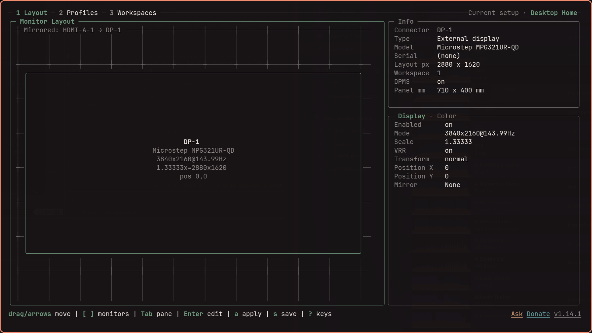
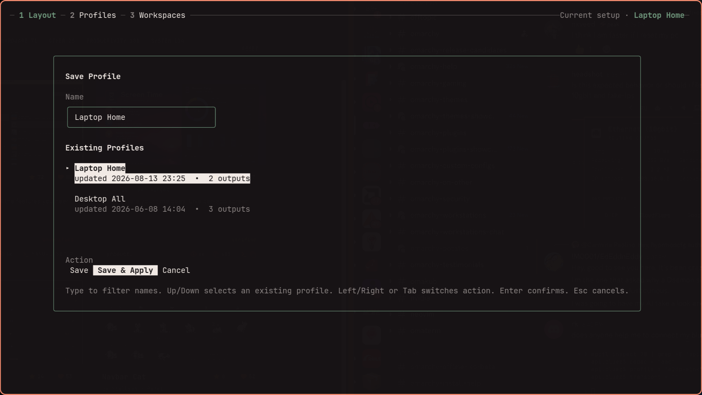

<div align="center">

<picture>
  <source media="(prefers-color-scheme: dark)" srcset="docs/assets/images/logotype_dark.svg">
  
</picture>

<strong>Create multi-monitor layouts for Hyprland.</strong><br>
Arrange visually. Save each setup. Switch automatically on hotplug and lid events.<br>
<strong>Then hand the whole machine to Steam on the TV, and take it back.</strong>

[](https://github.com/GustavoBelo/hyprmoncfg/releases)
[](https://opensource.org/licenses/MIT)

<a href="https://terminaltrove.com/hyprmoncfg/">
  <picture>
    <source media="(prefers-color-scheme: dark)" srcset="docs/assets/images/terminal-trove-tool-of-the-week-dark.svg">
    <source media="(prefers-color-scheme: light)" srcset="docs/assets/images/terminal-trove-tool-of-the-week-light.svg">
    
  </picture>
</a>

</div>

---

> [!NOTE]
> **This is a fork of [crmne/hyprmoncfg](https://github.com/crmne/hyprmoncfg) that adds Console Mode.**
>
> Everything upstream does, this does — the layout editor, the profiles, the
> daemon — because it tracks upstream and sends fixes back there. What it adds
> is one thing: a machine that is a desktop when you are at the desk and a games
> console when you are on the sofa, without being two machines.
>
> If you do not play games on a television, use [upstream](https://github.com/crmne/hyprmoncfg). It is the same tool without a feature you will not open, and it ships through the AUR.

hyprmoncfg is a visual multi-monitor layout editor and automatic profile switcher for Hyprland. Drag displays into place, save each setup as a hardware-aware profile, and let the daemon apply the right one when monitors or your laptop lid change.


## What you get

- **Spatial layout editor** -- drag monitors on a canvas and tune mode, scale, VRR, mirror, transform, and exact position
- **Named profiles** -- save setups like `desk`, `conference`, or `home-office`
- **Hardware-identity matching** -- profiles follow monitor make, model, and serial instead of unstable connector names
- **Hotplug and lid-aware daemon** -- apply the right profile automatically when monitors change or the laptop lid closes
- **Workspace planner** -- assign workspaces across monitors with sequential, interleave, or manual strategies
- **Safe apply with revert** -- reload Hyprland, verify the result, and revert unless you confirm
- **One-writer IPC** -- when the daemon is running, the TUI, CLI, and desktop panels send changes through it instead of racing over config files
- **Include-chain verification** -- refuse to write generated monitor config that Hyprland is not reading
- **Hyprland 0.55 Lua config support** -- write Lua automatically when `hyprland.lua` is active, while preserving legacy `.conf` setups
- **One hard runtime dependency** -- Hyprland; UPower is optional for immediate lid events
- **Console Mode** *(this fork)* -- hand the machine to Steam's gamescope session on the TV, and get the desktop back when you leave Big Picture

## Install

No distribution packages this fork — Console Mode only exists here — but every
[release](https://github.com/GustavoBelo/hyprmoncfg/releases) ships prebuilt
Linux binaries for amd64 and arm64:

```bash
version=1.18.1
curl -fsSL "https://github.com/GustavoBelo/hyprmoncfg/releases/download/v$version/hyprmoncfg_${version}_linux_amd64.tar.gz" \
  | tar -xz hyprmoncfg hyprmoncfgd
install -Dm755 hyprmoncfg  ~/.local/bin/hyprmoncfg
install -Dm755 hyprmoncfgd ~/.local/bin/hyprmoncfgd
```

Or build it:

```bash
git clone https://github.com/GustavoBelo/hyprmoncfg.git
cd hyprmoncfg
go build -o bin/hyprmoncfg  ./cmd/hyprmoncfg
go build -o bin/hyprmoncfgd ./cmd/hyprmoncfgd
install -Dm755 bin/hyprmoncfg  ~/.local/bin/hyprmoncfg
install -Dm755 bin/hyprmoncfgd ~/.local/bin/hyprmoncfgd
```

A plain `go build` reports its version as `dev`; [PACKAGING.md](PACKAGING.md)
has the flags that stamp a real one.

<details>
<summary>Packages for upstream hyprmoncfg — everything below except Console Mode</summary>

Arch Linux:

```bash
yay -S hyprmoncfg-bin
# or
yay -S hyprmoncfg-git
```

Fedora COPR:

```bash
sudo dnf copr enable paolino/hyprmoncfg
sudo dnf install hyprmoncfg
```

Nix / NixOS:

```bash
nix run nixpkgs#hyprmoncfg
nix profile install nixpkgs#hyprmoncfg
```

Gentoo GURU:

```bash
sudo eselect repository enable guru
sudo emaint sync -r guru
sudo emerge gui-apps/hyprmoncfg
```

Void Linux, via the unofficial [Blackhole-vl](https://github.com/Event-Horizon-VL/blackhole-vl) repo:

```bash
printf 'repository=https://mirror.black-hole.dev/%s/\n' "$(uname -m)" | sudo tee /etc/xbps.d/00-repository-blackhole.conf
sudo xbps-install -S
sudo xbps-install -S hyprland hyprmoncfg
```

Build upstream from source:

```bash
git clone https://github.com/crmne/hyprmoncfg.git
cd hyprmoncfg
go build -o bin/hyprmoncfg  ./cmd/hyprmoncfg
go build -o bin/hyprmoncfgd ./cmd/hyprmoncfgd
install -Dm755 bin/hyprmoncfg  ~/.local/bin/hyprmoncfg
install -Dm755 bin/hyprmoncfgd ~/.local/bin/hyprmoncfgd
```

</details>

Distro packagers should use [PACKAGING.md](PACKAGING.md).

## Configure Hyprland

hyprmoncfg writes `~/.config/hypr/hyprmoncfg-monitors.lua` (or `.conf` on legacy configs), a file it creates and owns, and adds one line at the end of your root Hyprland config to load it. Loading last is what makes an applied layout final: any monitor rule read afterwards would override it. Your own `monitors.conf` or `monitors.lua` is never replaced. Run `hyprmoncfg doctor` to check the load order at any time.

## Create your first profile

```bash
hyprmoncfg
```

Drag monitors into place, press `s`, type a profile name like `desk`, and press `Enter`.

Apply it later from the CLI:

```bash
hyprmoncfg apply desk
```

## Enable automatic switching

AUR, Fedora COPR, Nixpkgs, and Gentoo GURU:

```bash
systemctl --user daemon-reload
systemctl --user enable --now hyprmoncfgd
```

Void Linux with Blackhole-vl:

```text
exec-once = hyprmoncfgd
```

Manual install:

```bash
mkdir -p ~/.config/systemd/user
cp packaging/systemd/hyprmoncfgd.local.service ~/.config/systemd/user/hyprmoncfgd.service
systemctl --user daemon-reload
systemctl --user enable --now hyprmoncfgd
```

The daemon scores every profile in `~/.config/hyprmoncfg/profiles/`, so delete throwaway profiles before relying on automatic switching.

On Omarchy versions that launch `omarchy-hyprland-monitor-watch`, `hyprmoncfgd` stops that exact transient user scope while it owns monitor profiles and restores the watcher when the daemon exits during a live Hyprland session. Generated configuration used without the daemon cannot provide this runtime ownership; static-config users must disable the Omarchy watcher separately.

When the daemon is running, it is the canonical monitor-config writer. The TUI, CLI, and desktop integrations use its versioned Unix-socket IPC; when it is absent, the TUI and CLI keep working through the same core engine in direct mode. A profile selected interactively stays selected until the next monitor hotplug or lid change, when automatic matching resumes.

## Console Mode

The reason this fork exists. Console Mode closes your desktop and starts Steam's
gamescope session on the TV; leaving Big Picture brings the desktop back, with
sound where you left it.

It is not Big Picture in a window. gamescope becomes the compositor and owns the
display, which is where per-game HDR, VRR, FSR, tearing and the frame limiter
come from — Steam only offers those controls when the session it runs in declares
them, and only a real gamescope session does. The price is that your desktop is
gone while you play. That is the trade: a console instead of a game in a window.

### What you need

- **gamescope**, and a **gamescope session** package. On Arch and CachyOS that is
  `gamescope-session-cachyos`; other distributions package the same thing under
  other names. Console Mode looks for a session entry declaring
  `DesktopNames=gamescope`, never for a package name.
- **Steam**, logged in.
- The hosting session installed once — see below.

### Setting it up

```bash
hyprmoncfg console tv            # list displays
hyprmoncfg console tv HDMI-A-1   # choose the TV
hyprmoncfg console setup         # prints exactly what to change
hyprmoncfg console doctor        # says what is still missing
```

Switching works by *hosting*: your login manager starts one session that runs
your desktop compositor and swaps it for the gamescope session on request. The
login manager never sees the session end, so there is no greeter, no password
and no autologin to rewrite — and the same code works with SDDM, greetd, ly, or
no display manager at all.

That means the login manager has to start `hyprmoncfg console session` instead
of your compositor directly. It is the one step that needs root, it is done
once, and `console setup` prints the exact change and how to undo it. It never
edits a system file itself: only SDDM has been tested, and getting this wrong
leaves a machine that will not present a desktop.

### Using it

Click **Console Mode** in the panel or the app launcher, press `Enter` on the
Console tab of the TUI, or:

```bash
hyprmoncfg console status         # what it is set to do
hyprmoncfg console enter          # warns, waits, hands over
hyprmoncfg console leave          # ends the session from outside it
hyprmoncfg console boot last      # start wherever you left off
hyprmoncfg console trigger on     # a controller switching on starts a session
```

The TUI's Console tab is `4`, and it appears only once a gamescope session is
installed — a tab whose every action would fail is worse than no tab.

Come back from Big Picture: **Steam → Power → Switch to Desktop**.

Entering closes the desktop, so every way in announces itself first and can be
called off — **click the notification** and the desktop stays. Servers that draw
action buttons get a **Cancel** button too; most, Omarchy's own included, draw
none, so the click on the body is the answer that always works. Ten seconds when
you asked for it, twenty when a controller did, because that one is as often an
accident as an intention. `hyprmoncfg console cancel` stops it from anywhere,
including over ssh. Switching the controller back off stops it too, but only the
entry that controller started: a session you asked for by hand is not something
a pad going to sleep should call off.

### Worth knowing

- **Resolution and refresh are not set here.** gamescope takes the connector's
  preferred mode and Steam changes it per game, so a value recorded here would
  be a second source of truth disagreeing with the one in charge.
- **Bluetooth belongs to Steam.** In a gamescope session Steam manages the
  adapter and applies its own stored setting, which starts off. If a controller
  will not connect, turn Bluetooth on once in Steam's Quick Access Menu.
- **The Quick Access Menu** opens with the Steam button plus **A** (Cross on a
  PlayStation pad). Steam's own chord configuration leaves B/Circle unbound.
- **Only SDDM has been tested.** The hosting session is designed for any login
  manager or none, but greetd, ly, GDM and tty logins have not been tried.

Full walkthrough in the [Console Mode guide](docs/_guide/console-mode.md).

## Omarchy Quattro panel

On Omarchy Quattro, the panel is a full display manager in the bar: the layout
editor, saved profiles, the workspace planner, per-display brightness, and
keyboard control that mirrors the TUI. This fork's panel adds a Console page —
choose the TV, decide where the machine starts, and hand it over, without a
terminal.


Install this fork's panel, which is the only one that carries Console Mode:

```bash
omarchy plugin add https://github.com/GustavoBelo/omarchy-hyprmoncfg.git --enable
```

The upstream panel is on the [Omarchy Plugins marketplace](https://omarchyplugins.com/plugin.html?id=crmne.hyprmoncfg) and is everything above except the Console page.

If hyprmoncfg is not installed yet, open the panel and choose **Install hyprmoncfg**. It installs the stable AUR package, starts the daemon, and opens the layout editor so you can arrange and save your first profile. See the [Omarchy Quattro panel guide](https://hyprmoncfg.dev/omarchy/) for the full workflow.

## Screenshots

hyprmoncfg adapts to your theme. Here are some examples:

| Layout editor | Save dialog |
| --- | --- |
|  |  |

## Why it exists

Configuring monitors in Hyprland means writing `monitor=` lines by hand. A 4K display at 1.33333x scale is effectively 2880x1620 pixels, so the monitor next to it needs to start at x=2880. Vertically centering a 1080p panel against it means doing division in your head, reloading, noticing the layout is wrong, and editing again.

It gets worse when setups change:

- **No visual editor.** You write `monitor=` lines by hand and hope the coordinates are right.
- **No profiles.** Desk, projector, travel, and docked setups all need different layouts.
- **No automatic switching.** Hotplug a monitor and Hyprland guesses again.
- **Connector names are unstable.** `DP-1` and `DP-2` can swap between boots.
- **Some tools pull in too much.** Python, GTK, and GObject introspection are a lot of stack just to move a rectangle.

## How it works

hyprmoncfg ships two binaries:

| | |
|---|---|
| `hyprmoncfg` | TUI + CLI for layout editing, profile management, and workspace planning |
| `hyprmoncfgd` | Background daemon that auto-applies the best matching profile on hotplug and lid changes |

Both use the same apply engine:

```bash
write monitors.conf -> reload Hyprland -> verify live state -> confirm or revert
```

There is no separate best-effort daemon path. If the TUI can apply a profile correctly, the daemon uses the same machinery.

## Dotfiles integration

Profiles live in `~/.config/hyprmoncfg/profiles/`. Each profile has a canonical JSON file plus generated `.conf` and `.lua` sidecars you can keep as plain Hyprland snippets if you stop using hyprmoncfg. Add the directory to your dotfile manager and your layouts roam across every machine you own.

With [chezmoi](https://www.chezmoi.io/):

```bash
chezmoi add ~/.config/hyprmoncfg
```

Now your desk at home, your laptop on the road, and your Raspberry Pi in the closet all share the same profile library. The daemon picks the right one based on what's actually plugged in.

You don't commit the generated `~/.config/hypr/hyprmoncfg-monitors.{conf,lua}`. You commit your profiles. The tool writes the generated monitor config for you.

## How it compares

| | hyprmoncfg | Monique | HyprDynamicMonitors | HyprMon | nwg-displays | kanshi |
|---|---|---|---|---|---|---|
| GUI or TUI | TUI | GUI | TUI | TUI | GUI | CLI |
| Spatial layout editor | Yes | Yes | Partial | Yes | Yes | No |
| Drag-and-drop | Yes | Yes | No | Yes | Yes | No |
| Snapping | Yes | Not documented | No | Yes | Yes | No |
| Profiles | Yes | Yes | Yes | Yes | No | Yes |
| Auto-switching daemon | Yes | Yes | Yes | No (roadmap) | No | Yes |
| Workspace planning | Yes | Yes | No | No | Basic | No |
| Mirror support | Yes | Yes | Yes | Yes | Yes | No |
| Safe apply with revert | Yes | Yes | No | Partial (manual rollback) | No | No |
| Hyprland 0.55 Lua config | Yes | No | No | No | Yes | N/A |
| Include-chain verification | Yes | No | No | No | No | No |
| Hand the machine to a gamescope session | Yes *(this fork)* | No | No | No | No | No |
| Additional runtime dependencies | None | Python + GTK4 + libadwaita | UPower, D-Bus | None | Python + GTK3 | None |

## Docs

Everything upstream is documented at **[hyprmoncfg.dev](https://hyprmoncfg.dev)**,
and applies here unchanged.

Console Mode is only in this fork, so its documentation lives in the repository:
the [Console Mode guide](docs/_guide/console-mode.md) for the workflow, and
[commands](docs/_reference/commands.md) for the full command list.

## Development

Install the pre-commit hook to run CI checks locally before each commit:

```bash
ln -sf "$(pwd)/scripts/pre-commit" .git/hooks/pre-commit
```

The hook runs `go mod tidy`, `go vet`, `go test`, and `go build`.

Regenerate demo videos and screenshots:

```bash
./scripts/capture_media.sh
```

The media scripts use the installed `hyprmoncfg` from `PATH`.

Regenerate only the GIF and MP4 demo:

```bash
./scripts/capture_demo.sh
```

Regenerate only screenshots:

```bash
./scripts/capture_screenshots.sh
```

## This fork

hyprmoncfg is [Carmine Paolino's](https://github.com/crmne/hyprmoncfg). This fork
exists for one feature and tries to stay a fork rather than drift into a
different program: it merges upstream, keeps its design and its idioms, and
sends fixes back — the `cm = auto` profile-matching fix found while building
Console Mode went upstream as a pull request, not into a private patch.

Console Mode is the whole difference. It was built by measuring, not by
reasoning: the plan it started from was thrown away after a day on the real
machine proved that switching sessions through a display manager cannot work,
that nothing cleans the systemd user manager on the way out of a gamescope
session, and that WirePlumber does not move sound to the TV on its own. What
each of those cost to find is written into the comments where the fix lives,
which is the only place it cannot drift away from the code.

## License

MIT — upstream's licence, kept.
